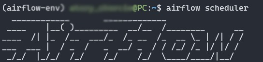
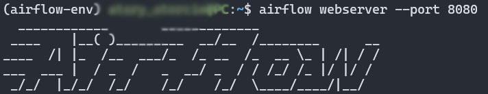
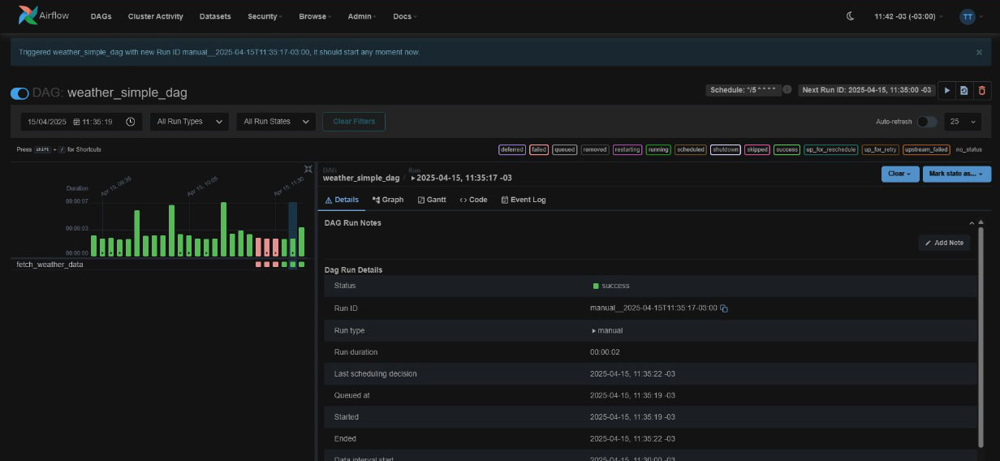
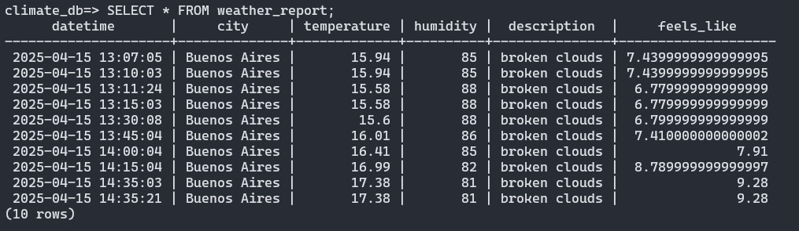

# Meteorology Pipeline 🌦️

This project automates the process of collecting, processing, and storing weather data. It uses the **OpenWeather API**, **Apache Airflow**, and **PostgreSQL** to create a streamlined pipeline for weather data retrieval and monitoring. The pipeline is scheduled and monitored via Apache Airflow and stores results in a PostgreSQL database for further analysis.

---

## Features 🚀
- **Real-time weather data**: Fetches weather data for a specified location (default: Buenos Aires, AR).
- **Data validation and processing**: Includes calculated "feels like" temperature for better insights.
- **Automated scheduling**: Managed by Apache Airflow for regular execution.
- **Database storage**: Data is stored in PostgreSQL for analysis or visualization.

---

## Installation and Setup 🛠️

### Prerequisites
- Ubuntu Linux: Due to native incompatibilities, Apache Airflow runs more reliably on Linux systems like Ubuntu.
- Python 3.8+
- PostgreSQL 12+
- Apache Airflow

### Steps
1. Clone the repository:
   ```bash
   git clone https://github.com/<your-username>/meteorology-pipeline.git
   cd meteorology-pipeline
   ```

2. Install Python dependencies:
   ```bash
   pip install -r requirements.txt
   ```

3. Set up PostgreSQL:
   - Create a database:
     ```sql
     CREATE DATABASE climate_db;
     ```
   - Use the provided SQL script to create the table:
     ```bash
     psql -U <your_username> -d climate_db -f sql/create_weather_table.sql
     ```

4. Export your OpenWeather API key as an environment variable:
   ```bash
   export OPENWEATHER_API_KEY="<your_api_key>"
   ```

5. Start Apache Airflow:
   - Initialize Airflow's database:
     ```bash
     airflow db init
     ```
   - Start the Airflow Scheduler and Webserver:
     ```bash
     airflow scheduler &
     airflow webserver --port 8080 &
     ```

6. Add the DAG file (`weather_pipeline.py`) to your Airflow `dags/` folder.

---

## Screenshots 📸
### Starting Airflow Services
Here’s how the terminal looks when starting the **Airflow Scheduler** and **Webserver**:



### Airflow Interface
Screenshot of the Apache Airflow interface showing the DAGs:


### Weather Report Table
Example of the PostgreSQL table `weather_report` with weather data:


---

## How It Works ⚙️
1. **The pipeline**:
   - The Airflow DAG (`weather_pipeline.py`) runs on a schedule or can be triggered manually.
   - It fetches weather data from the OpenWeather API.
   - The data is validated, processed, and saved to a PostgreSQL database.

2. **Outputs**:
   - **CSV report**: A CSV file is generated for archival purposes.
   - **Database entry**: Data is stored in the `weather_report` table for analysis.

---

## Database Schema 🗄️
Table: **`weather_report`**
| Column       | Type               | Description                      |
|--------------|--------------------|----------------------------------|
| `datetime`   | TEXT               | Timestamp of data collection     |
| `city`       | TEXT               | City name                        |
| `temperature`| FLOAT              | Temperature in Celsius           |
| `humidity`   | INT                | Humidity percentage              |
| `description`| TEXT               | Weather description (e.g., cloudy)|
| `feels_like` | FLOAT              | Feels-like temperature in Celsius|

---


¡Con este README, tu repositorio estará profesional y listo para destacar en GitHub! 🚀✨
